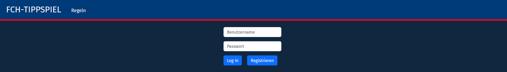
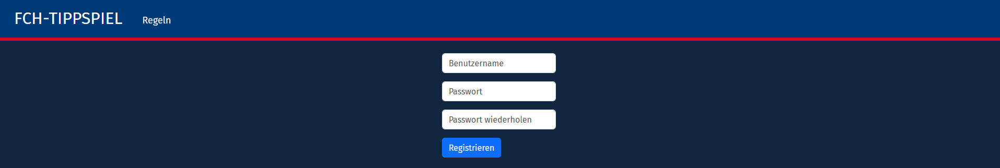
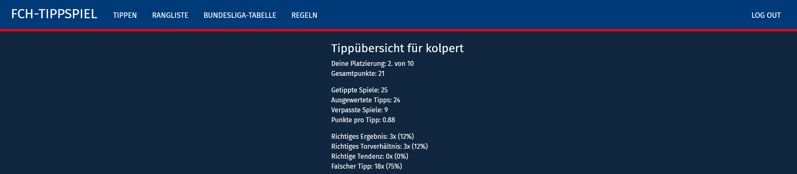
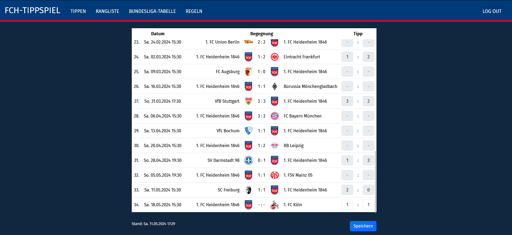
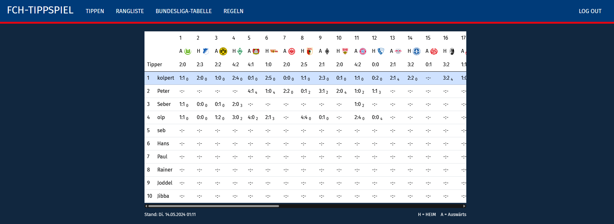
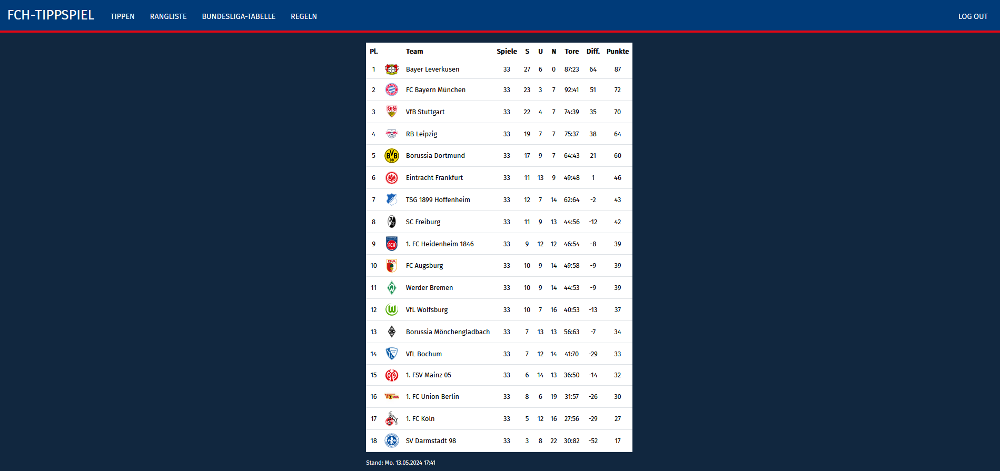
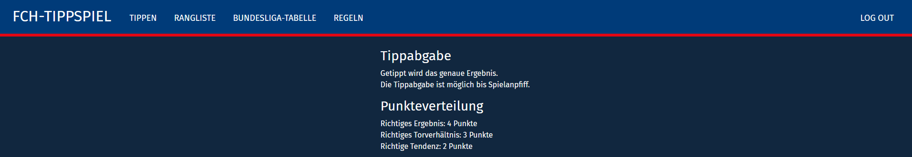

# Football Game Prediction Website
#### Video Demo:  https://youtu.be/ock13rYHtDw
#### Description:   A website where users can guess the outcome of football matches.

## Overview
The website allows users to predict the outcome of Bundesliga matches from the Club 1. FC Heidenheim 1846, which I'm a fan of. The users get points based on how correct their prediction was. In the "Rangliste"-Route they can view their current ranking among all the other users. The website is built using **Flask (and Jinja)**, **Bootstrap tables**, **sqlite** and an **API** called [**OpenLigaDB**](https://github.com/OpenLigaDB) for fetching the match and teams data.

## Routes
### Not logged in
There are three routes when the user is not logged in:
1. **Log In**: The user is prompted to login or register.

    
2. **Registrieren** (register): Here the user can set up an account. Password has to be repeated for security.

    

5. **Regeln** (rules): The rules are displayed in this route. For screenshot see down below in the logged in routes.

### Logged in
The website consists of five routes when logged in:
1. **Home**: Shows statistics about the users predictions (e. g. current rank, total points, points per game etc.)

    
2. **Tippen** (making predictions): Here you can input the final scores for matches that have not already had a kickoff (otherwise it is greyed out). By clicking the "Speichern"-Button (= german for 'saving') you can save your predictions. When that button is pressed, the server double checks if the input is valid (e. g. "are there scores for both teams?" "are these scores numeric?" "is the game already underway?") and then stores it if it is.

    

3. **Rangliste** (rankings): This is the page where users can see their rank based on the total points they got awarded. They can also see an overview of all predictions from all users and the points for each prediction. The rankings are made using multiple sql queries and formatting the data in python for making them displayable by jinja.

    
4. **Bundesliga-Tabelle** (Bundesliga table): Users can check this page to see the current standings of the Bundesliga. This way they can see how well the teams are doing in order to make more accurate guesses.

    

5. **Regeln** (rules): The rules are displayed in this route.

    


## Database
The sqlite database used for this website consists of four tables:
- users
- teams
- predictions
- FCH_matches


### users
The users table holds all information relevant to the individual. These include e. g. a unique ID, the username and the hashed password. This table also holds information about the predictions that have already been rated. For example the total points, the amount of correct results etc. are stored here. This is also done in order to make it easier to create the rankings table.

### teams
The teams table holds all teams. It is filled using the OpenLiga API. Besides basic team info like the name, the short name or an ID, this table also holds the path to the team icon image, so that the icon is more easily integrated into the html template. The teams table additionally consists of data necessary for the **Bundesliga-Table** route like points, opponent goals and so on. At last it holds the date of the last update for the updating routine and for showing the user how recent the data is (see screenshot).

### predictions
The predictions table holds all predictions of all users. It references the user id from the users table. Each prediction gets its own unique ID. It also holds a points column, that is only filled when the prediction is evaluated. The points are later used for calculating the total points per user.

### FCH_matches
This table holds all the information about the matchups of the 1. FC Heidenheim 1846 (in short, FCH). Additionally, it has a column that stores, whether the match has been already used for evaluating the predictions or not. This way, when updating the user scores (for more details on updating procedures, see below), not all matches have to be regarded again. This table also references the team id's of the teams table.


## Updating match and team data
There are different approaches for keeping the data up to date. They positively or negatively affect these aspects:
- Loading times
- Efficiency of the API / Amount of traffic


### First approach
In the beginning of the project, there was only a users and a prediction table in the database and everytime the user requested a page that required info about teams or matches, the API was used to fetch the data. This approach resulted in **slow loading times** and **excessive API use**. Often times you have to pay a small amount for every query you make and internet traffic consumes energy and money. So while being quick to implement, this approach is not optimal.

### Second approach
With this new approach, my goal was to minimise the use of the API, or more precisely speaking, to minimise the traffic through the API. So I thought  using the API for fetching the data was only necessary if new data was available. Therefore I needed a solution to store the data locally on the server and a way to know when new data was available. To solve the first problem, I created the **FCH_matches** and the **teams** table in the database. In order to know, when to update, I then implemented these two functions:

- is_update_needed_fch_matches() and
- is_update_needed_league_table()

They work by first looking at the dates of the last update from the database and then comparing that to the date of the last online change. So I still need to use the API for retrieving the date of the last online change, but the traffic used for this is **minimal**.

I used these functions every time a user requested a page where match or team data was displayed. While ensuring the data is up to date and the API use is efficient, the loading times were slow. So in order to solve that problem, I used a third approach.

### Final approach
In the final approach I check for updates for the **league table** and the **FCH matches** every time the user logs in. When the user opens a page that requires this data, it is always loaded from the database, significantly improving page load times. The downside is, that the data is no more perfectly up to date when the user stays logged in while goals happen or matches get kicked off or the final whistle is blown for example. That is why I need to let the user know how recent the data is. For that, I added a display of the last update time below the tables (see screenshots). Intuitively, users will understand that by logging out and back in it will ultimately update their data (aka the "have you tried turning it off?" paradigm).

### Future approaches
In the future, when the page may become more professional, the updates may happen independently of  user activity. The server could check for updates in a more regular manner or could get notified directly by the API instead of making a query every now and then. This way, the data will always be up to date while achieving fast loading times.

## Updating user scores
As per the last paragraph, the match and team data get checked for updates with every login. Now, every time new match data for the FCH is available, it makes sense to also update the user scores in the same go. So in app.py in the login-route, after having updated the match data the function update_user_scores() is called. Then the matches that have not been evaluated already get iterated over. For each match, all predictions for the match are loaded and the points are awarded according to the rules. Then, the total points, no. of correct results, no. of matches with correct goal difference etc. is updated for each user.

## OpenLiga API use
Generally, the API is free to use and maintained by it's community, where everyone can partake. To use the API, you need a valid **URL** and use that to get a response in **JSON format**. To automate this in Python, I wrote this function:

```
def get_openliga_json(url):
    try:
        response.raise_for_status()

        return response.json()

    except (KeyError, IndexError, requests.RequestException, ValueError):
        return None
```

By providing a valid URL, this function will return a list of dictionaries based on the content of the API response. In order to construct the URL, one can tinker on this [page](https://api.openligadb.de/index.html).

Here are some examples for common URL's used for this project:
```
url_matchdata = f"https://api.openligadb.de/getmatchdata/{league}/{season}/{team}"
url_table = f"https://api.openligadb.de/getbltable/{league}/{season}"
url_teams = f"https://api.openligadb.de/getavailableteams/{league}/{season}"
```
There also exist some URL's to retrieve update times, which is helpful for checking whether updates are needed or not. By making the URL's dynamic (by using f-strings), this project can be more easily adapted to other leagues or use cases.

## Folders
### Root directory
- app.py
- helpers.py

In Flask, you need to have an app.py file in the root folder, where the logic of the website is implemented (and the routes are stored). It is possible to use a file called helpers.py to store helper functions, that are then used in app.py by importing them.

### 'templates' folder
In the templates folder are all the html templates. "layout.html" is the most important one, setting the basic layout of all other templates and determining the look of the whole website. It contains for example the bootstrap links, the navbar design and how the body of the page is embedded. All the other templates contain the content of the body. The html files are all dynamically generated by using jinja within the templates.

### 'static' folder
In the static folder is the custom styles.css file that holds information about the colours, formatting and fonts. There also exists a 'bl1' folder containing a '2023' folder that holds the team icons as image files. These team icons are downloaded when inserting matches into the **FCH matches** database for the first time. They also get converted so each of them has the same size and so that the page doesn't take too long to load. For that, the *download_logos(teams)* and the *resize_image(img_file_path)* functions in helpers.py are used.


### 'images_readme' folder
Contains all the images used for this readme.
